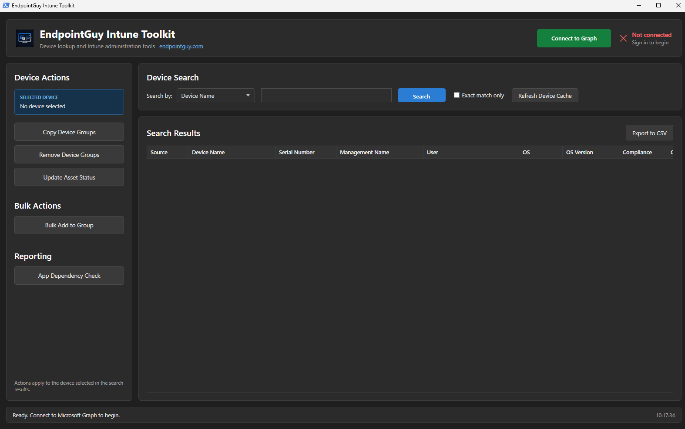

# EndpointGuy Intune Toolkit

A Windows PowerShell + WPF desktop app that puts the Intune and Entra ID jobs
a device admin actually does every day behind a few buttons, instead of a
portal tab, a console, and a half-remembered script.

Search for a device by name, serial number, or primary user, select it, and
run an action against it. Devices that have been imported into Windows
Autopilot but have not enrolled in Intune yet are included in the search, so a
brand new machine can be found - and added to groups - before it ever enrols.

Everything runs as the signed-in admin through Microsoft Graph. There is no
service account, no stored credential, and no agent: the toolkit can only do
what the person running it is already allowed to do.

This project was built largely with the assistance of Claude Opus 5. The
design decisions, testing, and the day-to-day admin experience behind it are
mine; a lot of the code was written with AI help.

<!-- Screenshot: main window with search results and the Device Actions panel. -->


## Recent changes

**Bulk Update Asset Status (new module).** The Asset Status module now has a
bulk counterpart. Feed it a CSV of device names, pick one status, and every
matched device has its Intune Management name set in a single run. Each name
is matched before anything is written - only names matching exactly one
device can be ticked - and the current Management name is shown beside the
new one so you can see what is being replaced. Every row reports its own
result. See [Bulk Update Asset Status](#bulk-update-asset-status).

**Advanced filter for search (new).** Search is no longer limited to one
field at a time. **Advanced Filter** builds a multi-column query where each
rule is a column, an operator and a value, and all rules have to match. Any
column in the results grid can be filtered, columns with a known set of
values give a drop-down instead of a text box, and a rule left without a
value is ignored rather than emptying the results. See
[Advanced filter](#advanced-filter).

**Embedded XAML - `.xaml` files removed.** Every module's WPF interface is
now baked into its `.ps1` file, so the standalone `.xaml` files are no
longer used and have been removed from the toolkit. Nothing needs doing if
you are updating an existing copy - delete any leftover `.xaml` files, as
they are read by nothing.

Both are on by default and can be switched off in `ModuleConfig.psd1` -
`BulkAssetStatus` for the new module. See [Configuration](#configuration).

## Contents

- [Recent changes](#recent-changes)
- [Install MSI](#install-msi)
- [Requirements](#requirements)
- [Getting started](#getting-started)
- [Modules](#modules)
- [Configuration](#configuration)
- [Graph permissions](#graph-permissions)
- [Package your own MSI](#package-your-own-msi)

## Install MSI

The release package includes a pre-built MSI. Running it installs the toolkit
to:

```
C:\Program Files\Endpoint Guy\Intune Toolkit
```

Installing is optional. The toolkit is plain PowerShell and runs fine from any
folder without being installed at all - unzip the package and launch it
directly with either:

- **`Run-Toolkit.bat`** - double-click it. This is the easier option, and the
  one to use if PowerShell scripts do not normally run on your machine.
- **`Toolkit.ps1`** - run it from a PowerShell prompt if you would rather
  launch it yourself or pass parameters.

Both start the same application. Use whichever suits how the machine is
managed.

## Requirements

| | |
|---|---|
| Operating system | Windows 10 or Windows 11 |
| PowerShell | Windows PowerShell 5.1 (ships with Windows - nothing to install) |
| PowerShell module | `Microsoft.Graph.Authentication` - installed automatically on first launch |
| Account | An Entra ID account with the Intune rights for the actions you intend to use |
| Network | Access to Microsoft Graph, plus the PowerShell Gallery on first launch only |

No local administrator rights are needed to run the toolkit. The Graph module
is installed for the current user only. Installing the MSI does require admin
rights, as it writes to Program Files - running from a folder does not.

### About the Graph module

On first launch the toolkit checks for `Microsoft.Graph.Authentication` and, if
it is missing, installs it for the current user. This step needs to reach the
PowerShell Gallery and can take a few minutes. Every later launch is offline
for this purpose and starts immediately.

If the Gallery is blocked on your network, install the module yourself from a
machine that can reach it:

```powershell
Install-Module Microsoft.Graph.Authentication -Scope CurrentUser
```

### Why STA mode matters

The interface is WPF, which requires PowerShell to run in single-threaded
apartment mode. `Run-Toolkit.bat` already passes the right switches. If you
launch the script yourself, include `-STA` or the window will not open:

```powershell
powershell.exe -NoProfile -STA -ExecutionPolicy Bypass -File .\Toolkit.ps1
```

## Getting started

### 1. Launch the toolkit

Start it from the Start menu shortcut if you installed the MSI, or by
double-clicking `Run-Toolkit.bat` in the program folder.

The first launch may pause for a few minutes while the Graph authentication
module is installed. Later launches open straight away.

### 2. Connect to Graph

Select **Connect to Graph** in the top right. Your browser opens the standard
Microsoft sign-in prompt, and the first time you connect you will be asked to
consent to the permissions the toolkit needs.

The indicator beside the button shows where you stand:

| Indicator | Meaning |
|---|---|
| **Not connected** (red) | Sign in before doing anything else |
| **Connected** (green) | Shows the signed-in account; the button becomes **Reconnect** |

Nothing is cached between sessions - you sign in each time the toolkit starts.

### 3. Find a device

Pick what you are searching by - **Device Name**, **Serial Number**, or
**Primary Username** - type your text, and select **Search** or press Enter.

Searches match on *contains* by default, so a partial name is enough. Tick
**Exact match only** to narrow it to a precise match.

Choose **Management Name** to filter by asset status instead of typing a
term. The free-text box is replaced by a drop-down of the lifecycle statuses
from the [Update Asset Status](#update-asset-status) module - the same list
`AssetStatusValues` defines in `ModuleConfig.psd1`, so the two can never
drift apart. Pick a status to list every device carrying that label, for
example every device currently marked `In-Stock`.

The status is matched against the *whole* Management name, ignoring case and
surrounding spaces, because the Asset Status module writes the status and
nothing else. Devices that have not enrolled in Intune yet have no Management
name, so they are never returned in this mode.

> **Filtering by location.** Because the status is the entire Management
> name, there is nothing in that field to identify a site, so a search
> cannot yet be narrowed to devices In-Stock at one location. To make that
> possible the location has to be recorded somewhere first - either appended
> to the Management name when the status is set, or held in the device
> category. Ask for this and it can be added.

#### Advanced filter

Select **Advanced Filter** to build a multi-column query instead of searching
one field at a time. Each rule is a column, an operator and a value, and
**all** rules have to match, so rules narrow the list as you add them.

Use **+ Add rule** for another condition, the red **−** to drop one, and
**Clear** to start again. For example, two rules - `Device Name starts with
TC1US` and `Management Name equals In-Stock` - return only the in-stock
devices at that site prefix.

Operators: *contains*, *does not contain*, *starts with*, *ends with*,
*equals*, *does not equal*, *is blank*, *is not blank*. The value box
disappears for the last two, since they take no value.

Any column shown in the results grid can be filtered - Device Name, Serial
Number, Management Name, User, OS, OS Version, Compliance, Ownership, Model,
Manufacturer, Category, Last Sync and Source.

Columns with a known set of values give you a drop-down rather than a text
box, so they cannot be mistyped:

| Column | Values |
| --- | --- |
| Management Name | the Asset Status lifecycle labels |
| Compliance | compliant, noncompliant, conflict, error, inGracePeriod, unknown |
| Ownership | company, personal, unknown |
| Source | Intune, Autopilot |

Everything else takes free text. Matching ignores case throughout, and `*`,
`?` or `[` in a value are matched literally rather than as wildcards.

`Last Sync` is text in `yyyy-MM-dd HH:mm` form, so *starts with* `2026-09`
is the way to pick a month - there is no before/after date comparison yet.

A rule left without a value is ignored rather than matching nothing, so a
half-finished rule cannot silently empty the results.

Results cover Intune managed devices and devices imported into Windows
Autopilot that have not enrolled yet, so a new machine can be found before it
is ever handed to anyone.

Results are cached, so searching again is instant. Select **Refresh cache** if
a device has changed in Intune and you need current data. **Export to CSV**
saves whatever is on screen.

### 4. Run an action

Select a device in the results grid, then choose an action from the panel on
the left. The device you picked is carried into the action window.

Anything that writes asks you to confirm first, and the prompt defaults to No.
Each action reports its result per item, so you can see exactly what happened.

> Only the actions enabled in this build appear. See
> [Configuration](#configuration) to switch modules on or off.

## Modules

Every action is a self-contained module. Any of them can be switched off if
your environment does not need it - a module that is off is not loaded, its
button does not appear, and its Graph permissions are not requested at
sign-in. See [Configuration](#configuration) for how to turn modules on and
off.

Self-contained means exactly that: the WPF interface for each module is
embedded in its own `.ps1` file. The separate `.xaml` files the toolkit
once shipped are no longer used and have been removed - there is nothing
to deploy alongside a module and nothing to keep in sync. A module is one
file, and editing that file is the only way its window changes.

In the toolkit the modules are grouped as **Device Actions**, **Bulk
Actions**, and **Reporting**.

### Device Actions

These act on the single device selected in the search results.

#### Copy Device Groups

Copies assigned security group memberships from the selected device to
another device. You search for and pick the target device, then review every
group the source device belongs to before anything is written.

Only assigned (static) groups can be copied. Dynamic groups are listed but
cannot be selected, because their membership is worked out by rule and cannot
be written to directly. Groups are added one at a time and each result is
reported.

#### Remove Device Groups

Removes the selected device from the assigned security groups it belongs to.
Every eligible group is ticked by default, so the common case - strip this
machine out of everything - is one click. Dynamic groups are shown but cannot
be selected.

A confirmation naming the device and the group count is shown first, and it
defaults to No. Each removal is written back into the grid as it happens.

#### Update Asset Status

This one is a deliberately specific use case. My organisation uses the Intune
Management name as the place where an asset's lifecycle status lives, so a
device reads as `Active`, `In-Stock`, `Retired` and so on at a glance in the
console. This module sets that value on the selected device from a drop-down,
rather than leaving people to type it by hand and spell it three different
ways.

If your organisation does not use the Management name this way, this is the
module to turn off first.

The status options are not fixed - they are defined in `ModuleConfig.psd1`,
so you can set them to whatever your organisation uses. See
[Configuration](#configuration) for details.

The current Management name is read from Graph when the window opens, and the
resulting name is shown before the write. The confirmation names the device,
the old name and the new name, and defaults to No.

> **The Management name is a label only.** Changing it does not retire, wipe
> or unenrol the device, and it leaves the device name, serial number, group
> memberships and assignments untouched.

### Bulk Actions

#### Bulk Add to Group

Adds many devices, listed in a CSV, to one security group. Device names are
read from the first column of the file and matched against Intune, and every
name is listed with its match state - so a typo or a decommissioned machine is
visible before anything is written. Only rows that matched exactly one device
are ticked.

You then search for and pick the target group. A confirmation naming the group
and the device count is shown first, and it defaults to No. Results can be
exported to CSV.

#### Bulk Update Asset Status

The bulk counterpart of [Update Asset Status](#update-asset-status). It sets
the Intune Management name on many devices at once, from a list of device
names in a CSV, so a whole shipment or a whole decommission batch is one
run rather than one window per machine.

Device names are read from the first column of the file - every line is
read, nothing is skipped - and each one is matched against Intune. Only a
name that matches exactly **one** managed device can be written to; names
that match nothing, or match several devices, are listed with the reason
and cannot be ticked.

The current Management name of every matched device is read from Graph and
shown in the grid beside the new one, so you can see exactly what is about
to be replaced before anything is written.

One status is picked for the whole batch, from the same drop-down the
single-device module uses. Both read the same `AssetStatusValues` list in
`ModuleConfig.psd1`, so the two can never drift apart, and a value that is
not on the approved list is refused before anything is written.

A confirmation naming the status and the device count is shown first, and
it defaults to No. Each row reports its own result as the run proceeds, so
a partial failure is visible per device rather than as one opaque error.
Results can be exported to CSV.

> **The Management name is a label only.** Changing it does not retire, wipe
> or unenrol any device, and it leaves device names, serial numbers, group
> memberships and assignments untouched.

### Reporting

#### App Dependency Check

Answers one question: which apps depend on the app I am about to change?

Picking a Win32 app and selecting **Find dependents** walks the relationship
graph upwards and lists every app that would be affected if that app were
changed, replaced or removed. Both direct dependents and indirect ones reached
through another app are listed, with the full chain shown. The list can be
exported to CSV.

> **Read-only.** Every Graph call this module makes is a GET, so it is safe to
> run against production at any time.

### Local Actions

#### Windows Updates

The odd one out. Every other module talks to Microsoft Graph; this one
connects to the machine itself over PowerShell Remoting (WinRM) and drives
the Windows Update Agent on it directly. That means it can do what Graph
cannot - scan, download and install specific updates on demand, and watch it
happen - but it also means the machine has to be online, reachable, and you
need local administrator rights on it.

Selecting a device and opening the module gives you **Test connection**
first, which checks DNS, WinRM and a remote command in turn and tells you
which of the three failed rather than just reporting failure.

**Scan** lists every update the machine is offered, with its size,
classification and whether a reboot is expected. Optional and driver updates
can be included. From there:

- **Download** fetches the ticked updates without installing anything.
- **Install** downloads if needed, then installs.

Both write, so both confirm first and both default to No. Progress is shown
per update - download percentage, install percentage and the result - rather
than one bar for the whole batch, because a single large update can otherwise
look like a hung window.

Feature updates (the `23H2`-style version upgrades) do not install through
the normal path - Windows refuses them with `0x80240022`. The module detects
them and routes them through the same mechanism Windows Update itself uses,
polling setup progress until it finishes.

> **Reboots are suppressed by default.** The module sets the no-auto-reboot
> policy for the duration of the run and puts the original value back
> afterwards, so an install cannot restart a machine out from under whoever
> is using it. Tick **Allow reboot** if you want the normal behaviour. Where
> a reboot is still pending at the end, the module says so rather than
> acting on it.

> **Requirements:** WinRM reachable on the target and local administrator
> rights on it. No Graph permissions are used or requested.

## Configuration

Everything configurable lives in a single optional file, `ModuleConfig.psd1`,
sitting next to `Toolkit.ps1`. It overrides the settings baked into the
script, so the same build can go to every site with only this one file
changing.

The file is optional. Delete it and the toolkit runs on its built-in
defaults - all five modules on, and the six built-in asset statuses. Any key
you omit falls back the same way, so the file only needs to contain what you
actually want to change.

```powershell
@{
    Modules = @{
        CopyDeviceGroups   = $true
        RemoveDeviceGroups = $true
        AssetStatus        = $true
        BulkAddToGroup     = $true
        AppDependencyCheck = $true
    }

    AssetStatusValues = @(
        'In-Stock'
        'Retired'
        'Recycled'
        'Stolen'
        'Legalhold'
        'Lost'
    )
}
```

> Changes are read at startup, so restart the toolkit for them to take effect.

### Turning modules on and off

Set a module to `$false` and three things happen: it is not loaded, its
button does not appear in the window, and its Graph permissions are not
requested at sign-in.

That last point is the useful one. A trimmed build asks for less consent, so
if you have no need for the group modules, switching them off means the
toolkit never asks for group write permissions at all.

The key names are fixed - they must match exactly, as below. A key that is
misspelled is ignored silently rather than reported, so the module simply
keeps whatever the script already had.

| Key | Button | Section |
| --- | --- | --- |
| `CopyDeviceGroups` | Copy Device Groups | Device Actions |
| `RemoveDeviceGroups` | Remove Device Groups | Device Actions |
| `AssetStatus` | Update Asset Status | Device Actions |
| `BulkAddToGroup` | Bulk Add to Group | Bulk Actions |
| `AppDependencyCheck` | App Dependency Check | Reporting |
| `WindowsUpdates` | Windows Updates | Local Actions |

### Asset status values

`AssetStatusValues` sets the statuses offered by the
[Update Asset Status](#update-asset-status) module. Whatever you list becomes
the drop-down, in the order you list it:

```powershell
AssetStatusValues = @(
    'Active'
    'In-Stock'
    'Retired'
)
```

The same list is also the approved list. A value that is not on it is refused
before anything is written, so the drop-down and the validation can never
drift apart. Remove the key entirely, or leave the list empty, to fall back to
the six built-in statuses.

Each entry is written verbatim into the Intune Management name, so type it
exactly as you want it to read in the console - `In-Stock` and `In Stock` are
two different labels. Blank entries and duplicates are dropped automatically.

### If the file cannot be read

A malformed `ModuleConfig.psd1` does not stop the toolkit. It reports the
problem and carries on with the built-in settings, so a stray comma cannot
leave anyone unable to work.

An earlier layout listed the module keys at the top level, without the
`Modules` wrapper. That form still works, so an existing file does not need
rewriting.

## Graph permissions

The toolkit signs in as you, using delegated permissions. It never holds a
client secret or a certificate, and it can only ever do what your own account
is already allowed to do in Intune - the Graph scopes below simply let the
toolkit act on your behalf, they do not grant you anything new.

The first sign-in shows a consent prompt listing these permissions. If your
tenant requires admin consent for them, that prompt appears instead and the
request goes to an administrator.

### Always requested

These cover the shell itself - device search, the local cache and the details
shown in the results grid.

| Scope | Why |
| --- | --- |
| `DeviceManagementManagedDevices.ReadWrite.All` | Read Intune devices, and set the Management name |
| `DeviceManagementConfiguration.Read.All` | Read configuration data |
| `Device.Read.All` | Read the Entra device records behind each machine |
| `User.Read.All` | Resolve primary users for search and display |
| `DeviceManagementServiceConfig.Read.All` | Read Autopilot records, so imported but not yet enrolled devices appear |

### Requested per module

Each enabled module adds its own scopes on top. A module that is switched off
contributes nothing, so a trimmed build asks the tenant for less - see
[Configuration](#configuration).

| Module | Additional scopes |
| --- | --- |
| Copy Device Groups | `Device.Read.All`, `Group.Read.All`, `Group.ReadWrite.All`, `GroupMember.ReadWrite.All` |
| Remove Device Groups | `Device.Read.All`, `Group.Read.All`, `Group.ReadWrite.All`, `GroupMember.ReadWrite.All` |
| Bulk Add to Group | `DeviceManagementManagedDevices.Read.All`, `Device.Read.All`, `Group.Read.All`, `Group.ReadWrite.All`, `GroupMember.ReadWrite.All` |
| App Dependency Check | `DeviceManagementApps.Read.All` |
| Update Asset Status | `DeviceManagementManagedDevices.ReadWrite.All` |
| Windows Updates | *(none - does not use Graph)* |

> **Windows Updates is the exception.** It does not call Graph at all, so it
> requests no scopes and adds nothing to the consent prompt. Instead it needs
> PowerShell Remoting (WinRM) to the target machine and local administrator
> rights on it, because the Windows Update Agent will only run locally.

Duplicates are merged, so a scope already in the base list is not requested
twice.

### Trimming what is requested

The group modules are the ones that pull in write access to groups. If you do
not need them, switching them off in `ModuleConfig.psd1` means
`Group.ReadWrite.All` and `GroupMember.ReadWrite.All` are never asked for at
all.

At the other end, a build with only App Dependency Check enabled is read-only
apart from the base scopes, since every call that module makes is a GET.

## Package your own MSI

The MSI shipped with the release was built with the free edition of
[Advanced Installer](https://www.advancedinstaller.com/). If you fork the
toolkit, change the defaults in `ModuleConfig.psd1` or strip out modules you
do not want, you can repackage it the same way and hand your own MSI to your
users.

The broad strokes:

1. Install Advanced Installer and start a new **Simple** installer project.
2. Point it at your toolkit folder so the whole thing - `Toolkit.ps1`,
   `Run-Toolkit.bat`, `Intune Toolkit.lnk`, `ModuleConfig.psd1` and the
   `Modules\` tree - is included, keeping the folder structure intact.
3. Set the install location, and use the packaged `Intune Toolkit.lnk` for
   any Start menu or desktop shortcut rather than pointing at the .bat.
4. Build. The result is a single MSI you can deploy however you normally
   deploy software.

Nothing about the toolkit depends on being installed this way, so there is no
special packaging step to get right - the MSI is only copying files into
place. The free edition covers everything needed for a package like this.

> Keep `ModuleConfig.psd1` editable after install if your users are expected
> to change it themselves. Under `C:\Program Files` they will need
> administrator rights to save an edit.